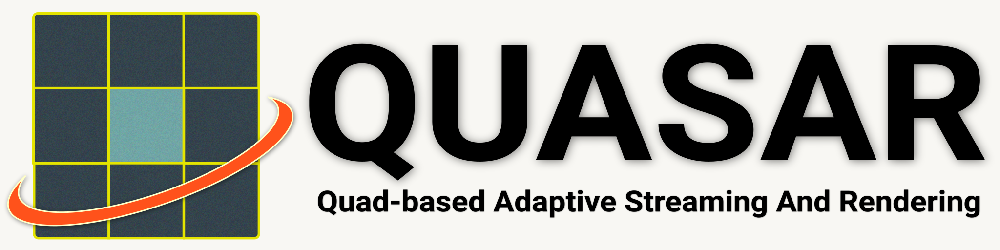

# 

## What is QUASAR?

`QUASAR` is a remote rendering system that represents scene views using pixel-aligned quads, enabling temporally consistent and bandwidth-adaptive streaming for high-quality, real-time visualization for thin clients.

This repository provides baseline implementations of remote rendering systems designed to support and accelerate research in the field.

It includes a custom deferred rendering system with support for PBR materials, dynamic lighting, and shadows, a scene loader compatible with GLTF, OBJ, and FBX formats, and multiple reprojection techniques including [ATW](https://developers.meta.com/horizon/blog/asynchronous-timewarp-examined/), [MeshWarp](https://dl.acm.org/doi/10.1145/253284.253292), [QuadStream](https://jozef.hladky.de/projects/QS/), and [QUASAR](https://github.com/quasar-gfx/QUASAR).

We also include an OpenXR client that runs the same renderer, which can be found [here](https://github.com/quasar-gfx/QUASAR-client).

## Docs

__Please refer to [QUASAR Documentation](https://quasar-gfx.github.io/QUASAR/) for more information!__

## Credits for 3D Assets

- **[Sponza](https://github.com/KhronosGroup/glTF-Sample-Models/tree/main/2.0/Sponza)**
- **[Damaged Helmet](https://github.com/KhronosGroup/glTF-Sample-Models/tree/main/2.0/DamagedHelmet)**
- **[Cerberus](https://sketchfab.com/3d-models/cerberusffvii-gun-model-by-andrew-maximov-d08c461f8217491892ad5dd29b436c90)**
- **[Robot Lab](https://assetstore.unity.com/packages/essentials/tutorial-projects/robot-lab-unity-4x-7006)** *(converted to .glb format from [here](https://github.com/dmitry1100/Robot-Lab))*
- **[Viking Village](https://assetstore.unity.com/packages/essentials/tutorial-projects/viking-village-urp-29140)** *(converted to .glb format from [here](https://github.com/nvjob/viking-village-nvjob-sky-water-stc))*
- **[UE4 Sun Temple](https://developer.nvidia.com/ue4-sun-temple)**
- **[San Miguel](https://casual-effects.com/data/)**
- **[Bistro](https://developer.nvidia.com/orca/amazon-lumberyard-bistro)**

## Credits for Third Party Libraries

- **[args.hxx](https://github.com/Taywee/args)**
- **[BS_thread_pool](https://github.com/bshoshany/thread-pool)**
- **[glfw](https://github.com/glfw/glfw)**
- **[glm](https://github.com/g-truc/glm)**
- **[imgui](https://github.com/ocornut/imgui)**
- **[jsmn](https://github.com/zserge/jsmn)**
- **[assimp](https://github.com/assimp/assimp)**
- **[lz4_stream](https://github.com/laudrup/lz4_stream)**
- **[lz4](https://github.com/lz4/lz4)**
- **[spdlog](https://github.com/gabime/spdlog)**
- **[stb](https://github.com/nothings/stb)**
- **[zstd](https://github.com/facebook/zstd)**

## Citation
If you find this project helpful for any research-related purposes, please consider citing our paper:
```
@article{lu2025quasar,
    title={QUASAR: Quad-based Adaptive Streaming And Rendering},
    author={Lu, Edward and Rowe, Anthony},
    journal={ACM Transactions on Graphics (TOG)},
    volume={44},
    number={4},
    year={2025},
    publisher={ACM New York, NY, USA},
    url={https://doi.org/10.1145/3731213},
    doi={10.1145/3731213},
}
```
