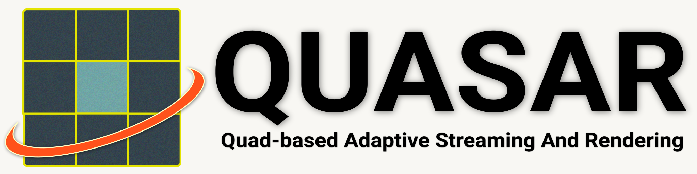

# 

## What is QUASAR?

`QUASAR` is a remote rendering system that represents scene views using pixel-aligned quads, enabling temporally consistent and bandwidth-adaptive streaming for high-quality, real-time visualization for thin clients.

This repository provides baseline implementations of remote rendering systems designed to support and accelerate research in the field.

It includes a custom deferred rendering system with support for PBR materials, dynamic lighting, and shadows, a scene loader compatible with GLTF, OBJ, and FBX formats, and multiple reprojection techniques including [ATW](https://developers.meta.com/horizon/blog/asynchronous-timewarp-examined/), [MeshWarp](https://dl.acm.org/doi/10.1145/253284.253292), [QuadStream](https://jozef.hladky.de/projects/QS/), and [QUASAR](https://github.com/EdwardLu2018/QUASAR).

We also include an OpenXR client that runs the same renderer, which can be found [here](https://github.com/EdwardLu2018/QUASAR-client).

## Install Dependencies

Note that any simulator or server code assumes at least OpenGL 4.3. Scene viewing and client code assumes at least OpenGL 4.1 or OpenGL ES 3.2.

### Ubuntu (reccomended)

NVIDIA GPUs with CUDA are *highly* reccomended, especially for streaming servers. Ubuntu machines with NVIDIA GPUs can run the scene viewer, simulators, streaming servers, and clients.

For any simulator or server code, at least 16 GB of VRAM is reccomended, though 8 GB can work for some scenes and techniques. Tested on machines with RTX 3070, RTX 3090, and RTX 4090 with CUDA 12 and up.

```
sudo apt install cmake libglew-dev libao-dev libmpg123-dev ffmpeg libavdevice-dev libavcodec-dev libavformat-dev libavutil-dev libswscale-dev libswresample-dev libavfilter-dev
```

Optional: Follow instructions [here](https://docs.nvidia.com/video-technologies/video-codec-sdk/12.0/ffmpeg-with-nvidia-gpu/index.html) for installing FFMPEG from source with CUDA hardware acceleration.

### MacOS

MacOS devices can run the scene viewer and the ATW client *only*. They are *not* recommended to run the servers or simulators, and cannot run any other clients.

```
brew install cmake glew ffmpeg
```

### OpenXR

We have implementations for scene viewing and streaming clients for Meta Quest VR headsets, which can be found [here](https://github.com/EdwardLu2018/QUASAR-client).

## Download 3D Assets

Sponza is cloned with the repo, but additional scenes can be downloaded at https://drive.google.com/file/d/1zL_hsmtjyOcAbNbud92aNCxjO1kwEqlK/view?usp=drive_link.

Download and unzip into `assets/models/Scenes/` (this will be gitignored).

## Building
```
mkdir build ; cd build
cmake ..; make -j
```

In the `build/` directory, there will be a folder called `apps/`, which follows the same directory layout as `<repo root>/apps/`.

## Sample Apps

### Scene Viewer

The Scene Viewer app loads a scene and lets you to fly through it using `wasd+qe`.

Run the Scene Viewer app:
```
# in build directory
cd apps/scene_viewer
./scene_viewer --size 1920x1080 --scene ../assets/scenes/robot_lab.json
```

### Asynchronous Time Warp (ATW)

The ATW app warps a previously rendered frame on a plane using a homography.

To run the simulator (simulates streaming over a configurable network):
```
# in build directory
cd apps/atw/simulator
./atw_simulator --size 1920x1080 --scene ../assets/scenes/robot_lab.json
```

To run streamer (actually streams over a network):
```
# in build directory
cd apps/atw/streamer
./atw_streamer --size 1920x1080 --scene ../assets/scenes/robot_lab.json
```

In a new terminal, to run receiver (streaming client):
```
# in build directory
cd apps/atw/receiver
./atw_receiver --size 1920x1080
```

### MeshWarp

The MeshWarp app warps a previously rendered frame by using a depth map to create a texture-mapped mesh.

To run the simulator:
```
# in build directory
cd apps/meshwarp/simulator
./meshwarp_simulator --size 1920x1080 --scene ../assets/scenes/robot_lab.json
```

To run streamer:
```
# in build directory
cd apps/meshwarp/streamer
./mw_streamer --size 1920x1080 --scene ../assets/scenes/robot_lab.json
```

In a new terminal, to run receiver:
```
# in build directory
cd apps/meshwarp/receiver
./mw_receiver --size 1920x1080
```

### QuadWarp

The QuadWarp app warps a previously rendered frame by fitting a series of quads from a G-Buffer.

To run the simulator:
```
# in build directory
cd apps/quadwarp/simulator
./quads_simulator --size 1920x1080 --scene ../assets/scenes/robot_lab.json
```

### QuadStream

The QuadStream app fits a series of quads from multiple G-Buffers from various camera views inside a headbox.

To run the simulator:
```
# in build directory
cd apps/quadstream/simulator
./qs_simulator --size 1920x1080 --scene ../assets/scenes/robot_lab.json
```

### QUASAR

The QUASAR app fits a series of quads from multiple G-Buffers from various depth peeling layers with fragment discarding determined by [Effective Depth Peeling (EDP)](https://cg.skku.edu/pub/2023-kim-siggraph-pvhv).

To run the simulator:
```
# in build directory
cd apps/quasar/simulator
./qr_simulator --size 1920x1080 --scene ../assets/scenes/robot_lab.json
```

## Evaluation

To run the evaluation descrobed in the paper, please see [scripts/](scripts).

## Credits for 3D Assets

- **[Sponza](https://github.com/KhronosGroup/glTF-Sample-Models/tree/main/2.0/Sponza)**
- **[Damaged Helmet](https://github.com/KhronosGroup/glTF-Sample-Models/tree/main/2.0/DamagedHelmet)**
- **[Cerberus](https://sketchfab.com/3d-models/cerberusffvii-gun-model-by-andrew-maximov-d08c461f8217491892ad5dd29b436c90)**
- **[Robot Lab](https://assetstore.unity.com/packages/essentials/tutorial-projects/robot-lab-unity-4x-7006)** *(converted to .glb format from [here](https://github.com/dmitry1100/Robot-Lab))*
- **[Viking Village](https://assetstore.unity.com/packages/essentials/tutorial-projects/viking-village-urp-29140)** *(converted to .glb format from [here](https://github.com/nvjob/viking-village-nvjob-sky-water-stc))*
- **[UE4 Sun Temple](https://developer.nvidia.com/ue4-sun-temple)**
- **[San Miguel](https://casual-effects.com/data/)**
- **[Bistro](https://developer.nvidia.com/orca/amazon-lumberyard-bistro)**

## Credits for Third Party Libraries

- **[args.hxx](https://github.com/Taywee/args)**
- **[BS_thread_pool](https://github.com/bshoshany/thread-pool)**
- **[glfw](https://github.com/glfw/glfw)**
- **[glm](https://github.com/g-truc/glm)**
- **[imgui](https://github.com/ocornut/imgui)**
- **[jsmn](https://github.com/zserge/jsmn)**
- **[assimp](https://github.com/assimp/assimp)**
- **[lz4_stream](https://github.com/laudrup/lz4_stream)**
- **[lz4](https://github.com/lz4/lz4)**
- **[spdlog](https://github.com/gabime/spdlog)**
- **[stb](https://github.com/nothings/stb)**
- **[zstd](https://github.com/facebook/zstd)**

## Citation
If you find this project helpful for any research-related purposes, please consider citing our paper:
```
@article{lu2025quasar,
    title={QUASAR: Quad-based Adaptive Streaming And Rendering},
    author={Lu, Edward and Rowe, Anthony},
    journal={ACM Transactions on Graphics (TOG)},
    volume={44},
    number={4},
    year={2025},
    publisher={ACM New York, NY, USA},
    url={https://doi.org/10.1145/3731213},
    doi={10.1145/3731213},
}
```
