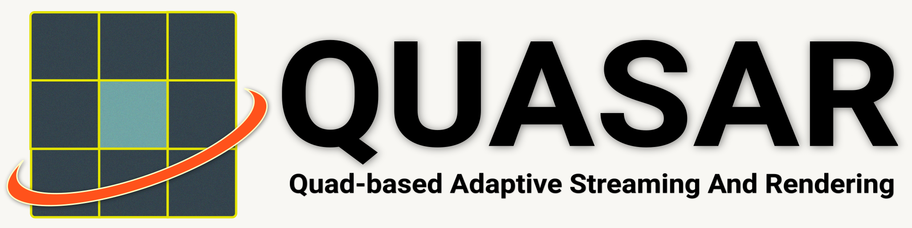

# 

| [Webpage](https://quasar-gfx.github.io/) | [Paper](https://quasar-gfx.github.io/assets/quasar_siggraph_2025.pdf) | [Video](https://www.youtube.com/watch?v=vWF89pXQkC0) | [Docs](https://quasar-gfx.github.io/QUASAR/) | [Main Code](https://github.com/quasar-gfx/QUASAR) | [OpenXR Code](https://github.com/quasar-gfx/QUASAR-client) |

## What is QUASAR?

`QUASAR` is a remote rendering system that represents scene views using pixel-aligned quads, enabling temporally consistent and bandwidth-adaptive streaming for high-quality, real-time visualization on thin clients.

This repository provides baseline implementations of components commonly used in remote rendering systems, designed to support and accelerate research in the field. It includes custom forward and deferred rendering engines with PBR materials, dynamic lighting, and shadows, along with a scene loader compatible with GLTF/GLB, OBJ, and FBX formats, and video and depth streaming from framebuffers.

We also integrate several reprojection techniques, including [ATW](https://developers.meta.com/horizon/blog/asynchronous-timewarp-examined/), [MeshWarp](https://dl.acm.org/doi/10.1145/253284.253292), [QuadStream](https://jozef.hladky.de/projects/QS/), and [QUASAR](https://quasar-gfx.github.io/), all of which can run in real time, with most supporting streaming over WiFi.

Additionally, an OpenXR-based client for Meta Quest VR headsets is available [here](https://github.com/quasar-gfx/QUASAR-client).

**Note:** `QUASAR` is an active research prototype, so expect API changes, unoptimized code, bugs, and missing features. Contributions are welcome!

## Documentation

**Please visit the ☞☞ [QUASAR documentation](https://quasar-gfx.github.io/QUASAR/) ☜☜ for information on how to build and run this repo!**

## Credits for 3D Assets

- **[Sponza](https://github.com/KhronosGroup/glTF-Sample-Models/tree/main/2.0/Sponza)**
- **[Damaged Helmet](https://github.com/KhronosGroup/glTF-Sample-Models/tree/main/2.0/DamagedHelmet)**
- **[Cerberus](https://sketchfab.com/3d-models/cerberusffvii-gun-model-by-andrew-maximov-d08c461f8217491892ad5dd29b436c90)**
- **[Robot Lab](https://assetstore.unity.com/packages/essentials/tutorial-projects/robot-lab-unity-4x-7006)** *(converted to .glb format from [here](https://github.com/dmitry1100/Robot-Lab))*
- **[Viking Village](https://assetstore.unity.com/packages/essentials/tutorial-projects/viking-village-urp-29140)** *(converted to .glb format from [here](https://github.com/nvjob/viking-village-nvjob-sky-water-stc))*
- **[UE4 Sun Temple](https://developer.nvidia.com/ue4-sun-temple)**
- **[San Miguel](https://casual-effects.com/data/)**
- **[Bistro](https://developer.nvidia.com/orca/amazon-lumberyard-bistro)**

## Credits for Third Party Libraries

- **[args.hxx](https://github.com/Taywee/args)**
- **[assimp](https://github.com/assimp/assimp)**
- **[BS_thread_pool](https://github.com/bshoshany/thread-pool)**
- **[FFmpeg](https://ffmpeg.org/)**
- **[glfw](https://github.com/glfw/glfw)**
- **[glm](https://github.com/g-truc/glm)**
- **[GStreamer](https://gstreamer.freedesktop.org/)**
- **[imgui](https://github.com/ocornut/imgui)**
- **[json](https://github.com/nlohmann/json)**
- **[lz4](https://github.com/lz4/lz4)**
- **[spdlog](https://github.com/gabime/spdlog)**
- **[stb](https://github.com/nothings/stb)**
- **[zstd](https://github.com/facebook/zstd)**

## Citation
If you find this project helpful for any research-related purposes, please consider citing our paper:
```
@article{lu2025quasar,
    title={QUASAR: Quad-based Adaptive Streaming And Rendering},
    author={Lu, Edward and Rowe, Anthony},
    journal={ACM Transactions on Graphics (TOG)},
    volume={44},
    number={4},
    year={2025},
    publisher={ACM New York, NY, USA},
    url={https://doi.org/10.1145/3731213},
    doi={10.1145/3731213},
}
```
